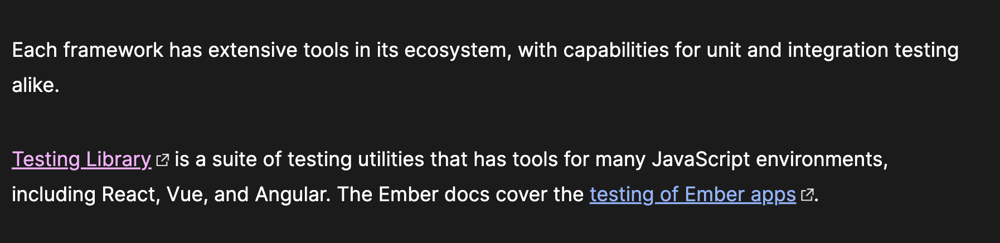

const subject = "World";
const header = (
  <header>
    <h1>Hello, {subject}!</h1>
  </header>
);

const subject = "World";
const header = React.createElement(
  "header",
  null,
  React.createElement("h1", null, "Hello, ", subject, "!"),
);

## TypeScript
TypeScript is a superset of JavaScript, meaning it extends JavaScript — all JavaScript code is valid TypeScript, but not the other way around. TypeScript is useful for the strictness it allows developers to enforce on their code. For instance, consider a function add(), which takes integers a and b and returns their sum.

TypeScript is a  superset of JavaScript , meaning it extends JavaScript - all JavaScript code is valid TypeScript ,but not the other way around. TyperScript is useful for the strictness it allows developer to enforce on their code. For instance, consider a function add(),which takes integers a  and b and returns their sum.

This code might be trivial for someone accustomed to JavaScript, but it could still be clearer.
This code might be trivial for someone accustomed to JavaScript , but it could still be clearer.

## Writing components

The code snippets in the rest of this section will use React as an example, and are written with JSX.

As mentioned in the previous chapter, most frameworks have some kind of component model. React components can be written with JSX, Ember components with Handlebars, and Angular and Vue components with a templating syntax that lightly extends.
As mentioned in the previous chapter, most frameworks have some kind of component model. React components can be written with JSX, Ember componets with HandLebars, and Angular and Vue components with a templating  syntax that lightly extends HTML.

Regardless of their opionions on how components should be written ,each framework's components offer a way to describe the external properties they may need , the internal state that the component should manage,and the events a user can trigger on the component's markup.
The code snippets in the rest of this section will use React as an example, and are written with JSX.

# Properties
Properties
Properties, or props, are external data that a component needs in order to render. 
Properties, or props, are external data that a component needs in order to render.

# State

We talked about the concept of state in the previous chapter - a robust state-handling mechanism is key to an effective framework, and each component may have data that needs its state controlled.

useState() is a React hook which, given an initial data value, will keep track of that value as it is updated. The code will be initially rendered like so in the browser:

The useState() call keeps track of the count value in a robust way across the app, without you needing to write code to do that yourself.

# Events

In order ot be interactive, components need ways to respond to browser events, so our applications can respond to our users.
Frameworks each provide their own syntax for listening to browser events, which reference the names of the equivalent native browser events.
In React, listening for the click event requires a special property,onClick. Let's update our CounterButton code from above to allow it to count clicks:

# Styling components
Each framework offers a way to define styles for your components -or for the application as a whole. Although each framework's approach to defining the styles of a component is slightly different, all of them give you multiple ways to do so. With the addition of some helper modules, you can style your framework apps in Saas or less, or transpile your CSS stylesheets with PostCSS.

# Handling dependencies
Handling dependencies 
All major frameworks provide mechanisms for handling dependencies - using components inside other components, sometimes with multiple hierarchy levels. As with other features, the exact mechanism will differ between frameworks, but the end result is the same. Components tend to import components into other components using the standard JavaScript module syntax, or at least something similar.

# Components in components
One key benefit of component-based UI architecture is that components can be composed together. Just like you can write HTML tags inside each other to build a website, you can use components inside other components to build a web application. Each framework allows you to write components that utilize (and thus depend on) other components.

One key benefit of component-based UI architecture is that components can be composed together, Just like you can write HTML 
tags inside each other to build a website, you can use components inside other components to build a web application. Each framework allows you to write components that utilize (and thus depend on ) other components.

# Styling components
Each framework offers a way to define styles for your components — or for the application as a whole. Although each framework's approach to defining the styles of a component is slightly different, all of them give you multiple ways to do so. With the addition of some helper modules, you can style your framework apps in Sass or Less, or transpile your CSS stylesheets with PostCSS.

Each framework offers a way to define styles for your components - or for the application as a whole. Although each framework's approach to defining the styles of a component is slightly different, all of them give you multiple ways to do so . With the addition of some helper modules, you can style your framework apps in Saas or Less, or transpile your CSS stylesheets with PostCSS.

# Handling dependencies
All major frameworks provide mechanisms for handling dependencies — using components inside other components, sometimes with multiple hierarchy levels. As with other features, the exact mechanism will differ between frameworks, but the end result is the same. Components tend to import components into other components using the standard JavaScript module syntax, or at least something similar.

All major frameworks provide mechanisms for handling dependencies - using components inside other components, sometimes with multiple hierarchy levels. As with other features, the exact mechanism will differ between frameworks, but the end result is the same. Components tend to import components into other components using the standard JavaScript module syntax, or at least something similar.

# Components in components

One key benefit of component-based UI architecture is that components can be composed together. Just like you can write HTML
tags inside each other to build a website, you can use components inside other components to build a web application. Each framework allows you to write components that utilize (and thus depend on )other components.

import AuthorCredit from "./components/AuthorCredit";

import AuthorCredit from "./components/AuthorCredit";

<Article>
  <AuthorCredit />
</Article>

<Article>
    <AuthorCredit />
</Article>

# LifeCycle 
https://projects.wojtekmaj.pl/react-lifecycle-methods-diagram/

## Rendering elements
https://developer.mozilla.org/en-US/docs/Learn/Tools_and_testing/Client-side_JavaScript_frameworks/Main_features

Just as with LIfeCycles, frameworks take different-but-similar approaches to how they render your applications. All of them track the current rendered version of your browser's DOM, and each makes slightly different decisions about how the DOM should change as components in your application re-render. Because frameworks make these decisions for you, you typically don't interact with the DOM yourself. This abstraction away from the DOM is more complex and more memory-intensive than updating the DOM yourself , but without it, frameworks could not allow you  to program in the  declarative way they're known

The virtual DOM is an approach whereby information about your browser's DOM is stored in JavaScript memory. Your application updates this copy of the DOM, then compares it to the "real" DOM - the DOM that is actually rendered for your users - in order to decide what to render. The application builds a "diff" to compare the differences betweeen  the updated virtual DOM
and the currently rendered DOM, and uses that diff to apply updates to the real DOM. Both React and Vue utilize a virtual DOM mode, but they do not apply the exact same logic when diffing or rendering.

You can read more about the Virtual DOM in the React docs.

The Incremental DOM is similar to the virtual DOM in that it builds a DOM diff to decide what to render, but different in that it doesn't create a complete copy of the DOM in JavaScript memory. It ignores the parts of the DOM that do not need to be changed. Angular is the only framework discussed so far in this module that uses an incremental DOM.

You can read more about the Incremental DOM on the Auth0 blog.

The Glimmer VM is unique to Ember. It is not a virtual DOM nor an incremental DOM; it is a separate process through which Ember's templates are transpiled into a kind of "byte code" that is easier and faster to read than JavaScript.

// The Incremental DOM is similar to the virtual DOM in that it builds a DOM diff to decide what to render, but different in that it doesn't create a complete copy of the DOM in JavaScript memory. It ignores the parts of the DOM that do not need to be changed .Angular is the only framework discussed so far in this module that uses an incremental DOM>
## Routing
As mentioned in the previous chapter, routing is an important part of the web experience. To avoid a broken experience in sufficiently complex apps with lots of views, each of the frameworks covered in this module provides a library (or more than 
one library) that helps developers implement client-side routing in their applications.

##:Testing
https://developer.mozilla.org/en-US/docs/Learn/Tools_and_testing/Client-side_JavaScript_frameworks/Main_features

Testing Library is a suite of testing utilities that has tools for many JavaScript environments, including React, Vue, and Angular. The Ember docs cover the testing of Ember apps.
Testing LIbrary is a suite of testing utilities that has tools for many JavaScript environments, including React, Vue, and 
Angular. The Ember docs cover the testing of Ember apps.
