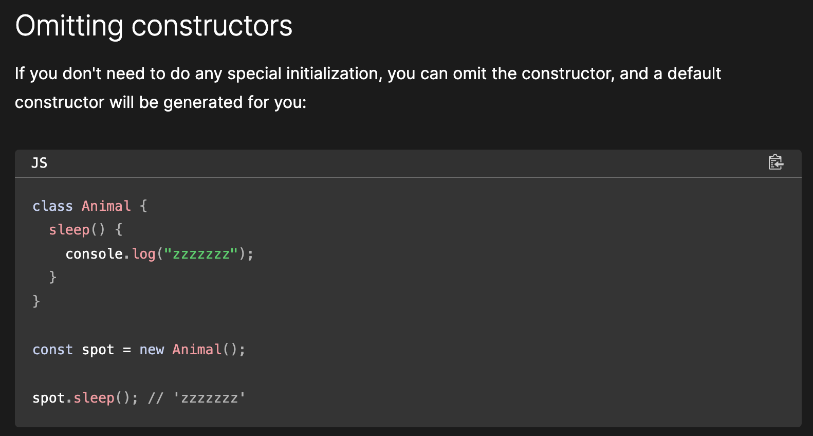

#Omitting  constructors

Since we want to set teaches when a new Professor is created, we define a constructor, which takes the name and teaches as arguments. The first thing this constructor does is call the superclass constructor using super(), passing up the name parameter. The superclass constructor takes care of setting name. After that, the Professor constructor sets the teaches property.

Since we want to set teaches when a new Professor is created, we 
define a constructor, which takes the name and teaches as arguments.
The first thing this constructor does is call the superclass
constructor using super(), passing up the name parameter.The
superclass constructor takes care of setting name. After that, the 
Professor constructor sets the teaches property.

Encapsulation
Finally, let's see how to implement encapsulation in JavaScript. In the last article we discussed how we would like to make the year property of Student private, so we could change the rules about archery classes without breaking any code that uses the Student class.

Encapsulation 
Finally, let's see how to implement encapsulation in JavaScript. In the last article we discussed how we would like to make the year 
property of Student private, so we could change the rules about 
archery classes without breaking any code that used the Student class.

class Student extends Person {
  #year;

  constructor(name, year) {
    super(name);
    this.#year = year;
  }

  introduceSelf() {
    console.log(`Hi! I'm ${this.name}, and I'm in year ${this.#year}.`);
  }

  canStudyArchery() {
    return this.#year > 1;
  }
}
