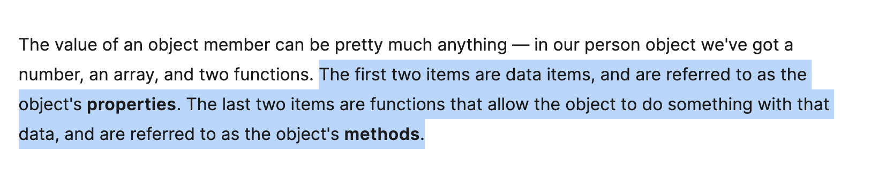
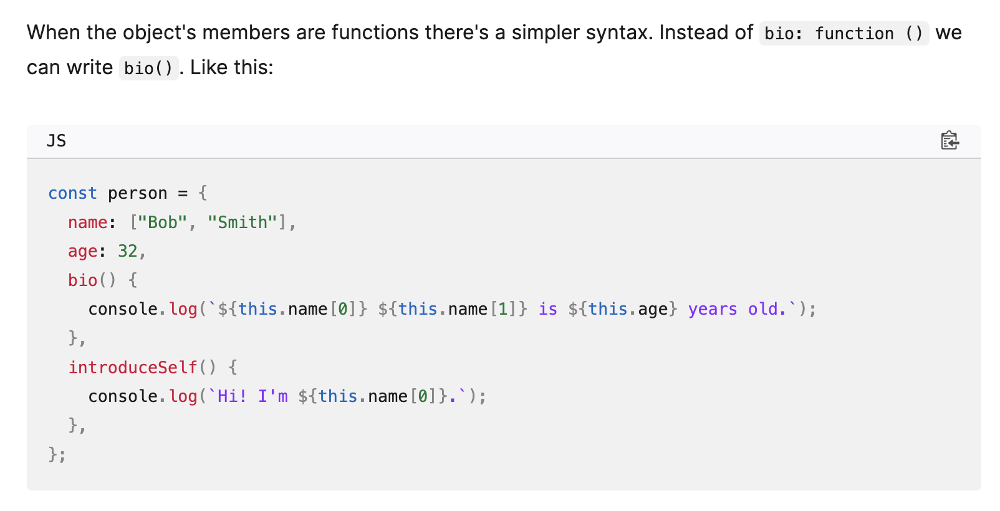
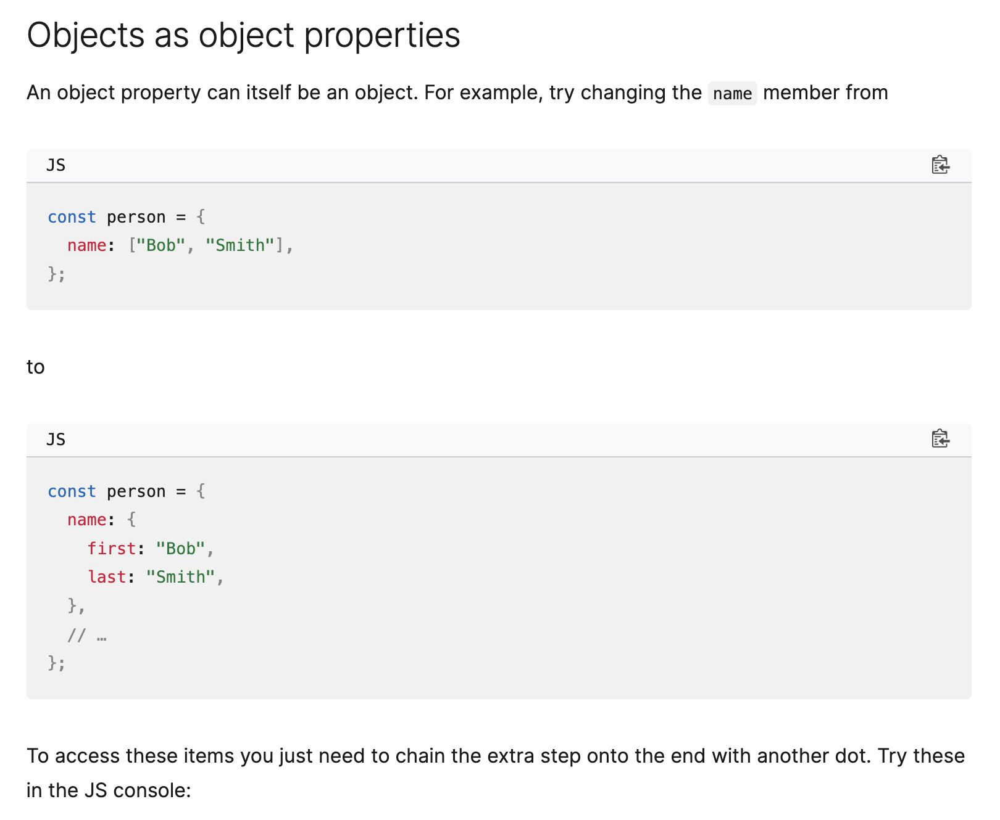
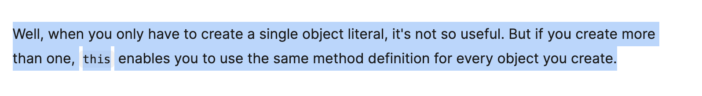
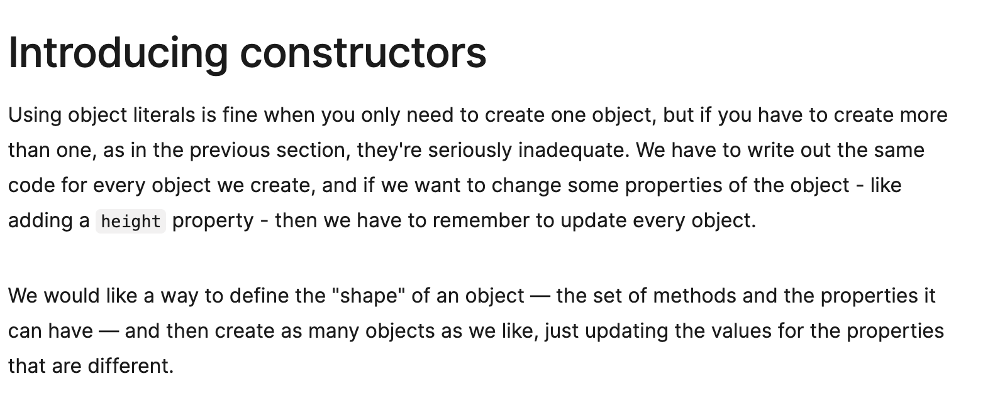
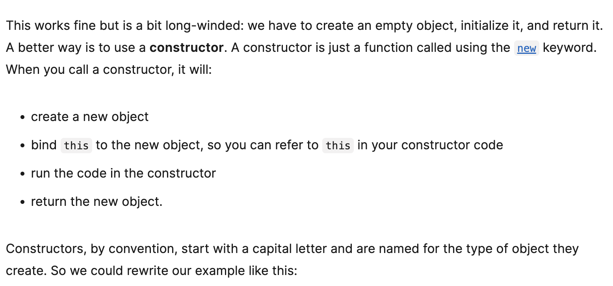
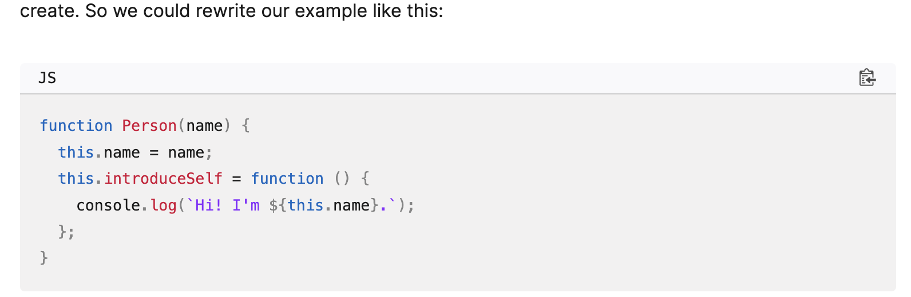

#Object basics
Object basics
An object is a collection of related data and/or functionality. These usually consist of several variables and functions (which are called properties and methods when they are inside objects). Let's work through an example to understand what they look like.

These usually consist of several variables and functions (which are called properties and methods when they are inside objects). Let's work through an example to understand what they look like.

So what is going on here? Well, an object is made up of multiple members, each of which has a name (e.g. name and age above), and a value (e.g. ['Bob', 'Smith'] and 32). Each name/value pair must be separated by a comma, and the name and value in each case are separated by a colon. The syntax always follows this pattern:

So what is going on here? Well ,an object is made up of multiple members,each of which has a name (e.g. name and age above), and a value (e.g.) Notes:
Each name / value pair must be separated by a comma, and the name and value in each case are separated by a colon. The syntax always follows this pattern:

const objectName = {
  member1Name: member1Value,
  member2Name: member2Value,
  member3Name: member3Value,
};

const objectName ={

    member1Name: member1Value,
    member2Name: member2Value,
    member3Name: member3Value,
};

The first two items are data items, and are referred to as the object's properties. The last two items are functions that allow the object to do something with that data, and are referred to as the object's methods.

The first two items are data items, and are referred to as the object's properties. The last two items are functions that allow the object to do something with that data, and are referred to as the object's methods.

When the object's members are functions there's a simpler syntax. Instead of bio: function () we can write bio(). Like this:
When the object's members are functions there's a simpler syntax. Instead of bio: function()
we can write bio(). like this:

const person ={
    name : ["Charels","wong"],
    age:32,
    bio(){
        console.log(`${this.name[0]} ${this.name[1]}`)
    }

}

const person = {
  name: ["Bob", "Smith"],
  age: 32,
  bio() {
    console.log(`${this.name[0]} ${this.name[1]} is ${this.age} years old.`);
  },
  introduceSelf() {
    console.log(`Hi! I'm ${this.name[0]}.`);
  },
};

objects as properties of objects

const person={
    name : ["charles","Wong"],
}

const person ={
    name :{
       first: "charles";
        last : "Wong";
    }
}
person.age;
person.name.first;

another way to express

person["age"];
person["name"]["first"];

const person = {
  name: ["Bob", "Smith"],
  age: 32,
};

function logProperty(propertyName) {
  console.log(person[propertyName]);
}

logProperty("name");
// ["Bob", "Smith"]
logProperty("age");
// 32

点表示法通常优于括号表示法，因为它更简洁且更易于阅读。然而，在某些情况下你必须使用括号。例如，如果对象属性名称保存在变量中，则不能使用点表示法访问该值，但可以使用括号表示法访问该值。

在下面的示例中，logProperty() 函数可以使用 person[propertyName] 来检索 propertyName 中指定的属性的值。

JS
Copy to Clipboard
introduceSelf() {
  console.log(`Hi! I'm ${this.name[0]}.`);
}
You are probably wondering what "this" is. The this keyword refers to the current object the code is being written inside — so in this case this is equivalent to person. So why not just write person instead?

You are probably wondering what "this " is . The this keyword refers to the current object the 
code is being written inside - so in this case this is equivalent to person. So why not just write person instead?

Well, when you only have to create a single object literal, it's not so useful. But if you create more than one, this enables you to use the same method definition for every object you create.

Well, when you only have to create a single object literal, it's not so userful. But if you 
create more than one, this enables you to use the same method definition for every object you create.

Using object literals is fine when you only need to create one object, but if you have to create more than one, as in the previous section, they're seriously inadequate. We have to write out the same code for every object we create, and if we want to change some properties of the object - like adding a height property - then we have to remember to update every object.

We would like a way to define the "shape" of an object — the set of methods and the properties it can have — and then create as many objects as we like, just updating the values for the properties that are different.
Using object literals is fine when you only need to create one object, but if you have to create more than one, as in the pervious section, they're seriously inadequate. We have to write out the same code for every object we create, and if we want to change some properties of the object - like adding a height property - then we have to remember to update every object.

We would like a way to define the "shape" of an objet - the set of methods and the properties it can have - and then create as many objects as we like, just updating the values for the 
properties that are different.

This works fine but is a bit long-winded: we have to create an empty object, initialize it, and return it. A better way is to use a constructor. A constructor is just a function called using the new keyword. When you call a constructor, it will:

create a new object
bind this to the new object, so you can refer to this in your constructor code
run the code in the constructor
return the new object.
Constructors, by convention, start with a capital letter and are named for the type of object they create. So we could rewrite our example like this:

// A better way is to use a constructor. A constructor is just a fucntion called using the new keyword. When you call a constructor, it will:

create a new object
bind this to the new object, so you can refer to this in your constructor code
run the code in the constructor
return the new object.

Constructor, by convention, start with a capital letter and are named for the type of objet they create. So we could rewrite our example like this:

remember : this is a construction

function Person(name){
    this.name =name;
    this.introduceSelf=function (){
        console.log(`Hi,I'm ${this.name}.`)

    }
}

