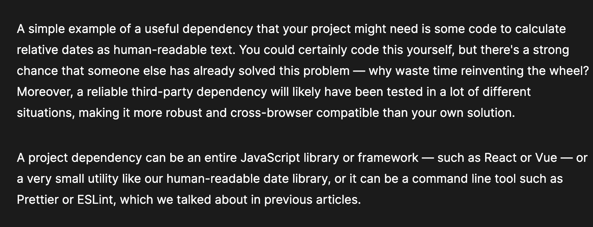
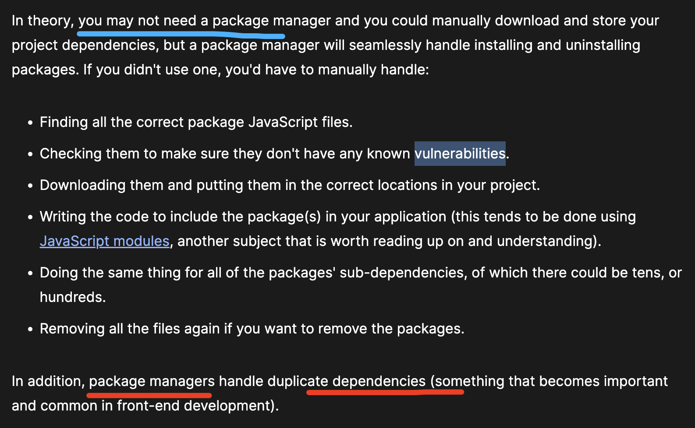
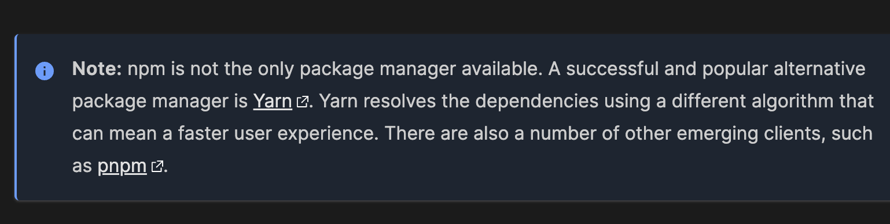
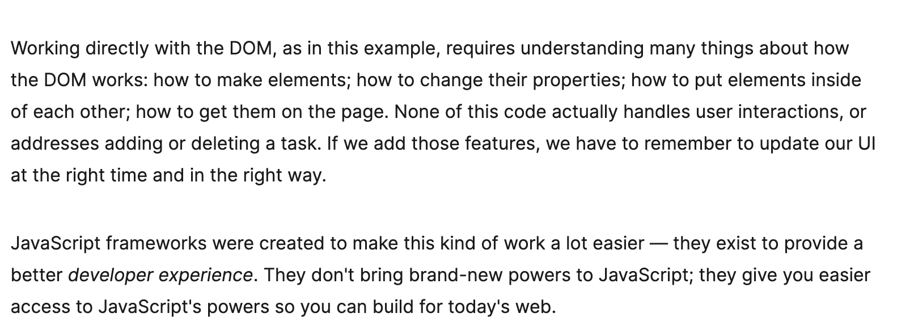
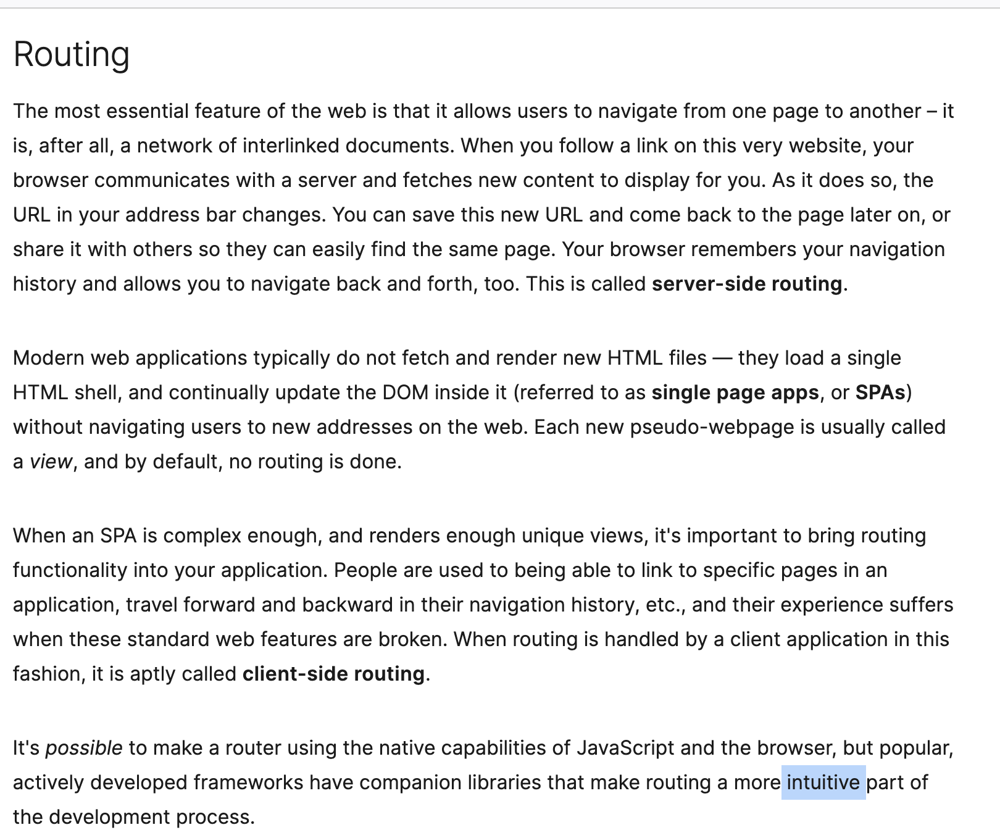
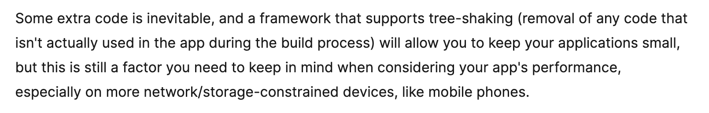

# Note of the front end developer.

程序员的算法实录：
https://github.com/youngyangyang04/leetcode-master
精通JavaScript 面试：
https://cloud.tencent.com/developer/article/1460427
算法：https://www.hello-algo.com/chapter_preface/about_the_book/

百度的AI：问答：
https://www.baidu.com/s?wd=%E8%A7%A3%E9%87%8A%E8%BF%99%E4%B8%AA%E5%87%BD%E6%95%B0function%20random(number)%20%7B%20return%20Math.floor(Math.random()%20*%20(num&rsv_spt=1&rsv_iqid=0xcb17f22900abcc41&issp=1&f=8&rsv_bp=1&rsv_idx=2&ie=utf-8&tn=baiduhome_pg&rsv_dl=ib&rsv_enter=1&rsv_sug3=27&rsv_sug1=17&rsv_sug7=100&rsv_sug2=0&rsv_btype=i&inputT=373307&rsv_sug4=373306

GPT AI :https://poe.com/

## Drawing graphics
https://docs.qq.com/doc/DWGphU1ZsWlhVQllZ
5 月30日
## Command line crash course
https://developer.mozilla.org/en-US/docs/Learn/Tools_and_testing/Understanding_client-side_tools/Command_line

One of the biggest criticisms of the command line is that it lacks hugely in user experience. Viewing the command line for the first time can be a daunting experience: a blank screen and a blinking cursor, with very little obvious help available on what to do.

One of the biggest criticisms of the command line is that it lacks hugely in user experience. Viewing the command line for the first time can be a daunting experience: a blank screen and a blinking cursor, with very little obvious help available on what to do.

## git for windows
https://gitforwindows.org/

专门提供 terminal practice :https://tldr.sh/
node.js
https://nodejs.org/en

## Package management basics
https://developer.mozilla.org/en-US/docs/Learn/Tools_and_testing/Understanding_client-side_tools/Package_management

In this article, we'll look at package managers in some detail to understand how we can use them in our own projects — to install project tool dependencies, keep them up-to-date, and more.

In this article, we'll look at package managers in some detail to understand how we can use them in our own projects - to install project tool dependencies, keep them up-to-date, and more.

A dependency is a third-party bit of software that was probably written by someone else and ideally solves a single problem for you. A web project can have any number of dependencies, ranging from none to many, and your dependencies might include sub-dependencies that you didn't explicitly install — your dependencies may have their own dependencies.

A dependency is a third-party bit of software that was probably written by someone else and ideally solves a single problem for you. A web project can have any number of dependencies, ranging from none to many, and your dependencies might include sub-dependencies that you didn't explicitly install - your dependencies may have their own dependencies.

A simple example of a useful dependency that your project might need is some code to calculate relative dates as human-readable text. You could certainly code this yourself, but there's a strong chance that someone else has already solved this problem — why waste time reinventing the wheel? Moreover, a reliable third-party dependency will likely have been tested in a lot of different situations, making it more robust and cross-browser compatible than your own solution.

A project dependency can be an entire JavaScript library or framework — such as React or Vue — or a very small utility like our human-readable date library, or it can be a command line tool such as Prettier or ESLint, which we talked about in previous articles.

A simple example of a useful dependency that your project might need is some code to calculate relative dates as human-readable text. You could certainly code this yourself, but there's a strong chance that someone else has already solved this problem - why waste time re-inventing the wheel? Moreover, a reliable third-party dependency will likely have been tested in a lot of different situations, making it more robust and cross-browser compatible than your own solution.

//A project dependency can be an entire JavaScript library or framework - such as React or Vue - or a very small utility like our human-readable date library, or it can be a command line tool such as Prettier or ESLint, which we talked about in previous articles.

In addition, what happens if you find a better tool that you want to use instead of the current one, or a new version of your dependency is released that you want to update to? 
This is not too painful for a couple of dependencies, but in larger projects with many dependencies, this kind of thing can become really challenging to keep track of. It makes more sense to use a package manager such as npm, as this will guarantee that the code is added and removed cleanly, as well as a host of other advantages.

// This is not too painful for a couple of dependencies, but in larger projects with many dependencies, this kind of thing can become really challenging to keep track of. It makes more sense to use a package manager such as npm, as this will guarantee that the code is added and removed cleanly, as well as a host of other advantages.

## What exactly is a package manager?
We've met npm already, but stepping back from npm itself, a package manager is a system that will manage your project dependencies.

//We've met npm already, but stepping back from npm itself, a package manager is a system that will manage your project dependencies.

In theory, you may not need a package manager and you could manually 
download and store your project dependencies, but a package manager
will seamlessly handle installing and uninstalling packages. If you
didn't use one, you'd have to manually handle:
// 
finding all the correct package JavaScript files.
Checking them to make sure they don't have any known vulnerabilities.
Downloading them and putting them in the correct locations in your project.
Writing the code to include the package(S) in your application (this tends to be done using JavaScript modules, another 
subject that is worth reading up on and understanding).
Doing the dame thing for all of the packages' sub-dependencies, of which there could be tens, or hundreds.
Removing all the files again if you want to remove the packages.
In addition, package managers handle duplicate dependencies (something that becomes important and common in front-end development).

In theory, you may not need a package manager and you could manually download and store your project dependencies, but a package manager will seamlessly handle installing and uninstalling packages. If you didn't use one, you'd have to manually handle:

Finding all the correct package JavaScript files.
Checking them to make sure they don't have any known vulnerabilities.
Downloading them and putting them in the correct locations in your project.
Writing the code to include the package(s) in your application (this tends to be done using JavaScript modules, another subject that is worth reading up on and understanding).
Doing the same thing for all of the packages' sub-dependencies, of which there could be tens, or hundreds.
Removing all the files again if you want to remove the packages.
In addition, package managers handle duplicate dependencies (something that becomes important and common in front-end development).

In the case of npm (and JavaScript- and Node-based package managers) you have two options for where you install your dependencies. As we touched on in the previous article, dependencies can be installed globally or locally to your project. Although there tend to be more pros for installing globally, the pros for installing locally are more important — such as code portability and version locking.

In the case of npm (and JavaScript- and Node-based package managers) you have two options for where you install your dependencies.As we touched on in the previous article, dependencies can be installed globally or locally to your project.
Although there tend to be more pros for installing globally, the pros for installing locally are more important -such as code portability and version locking.

Note: npm is not the only package manager available. A successful and popular alternative package manager is Yarn. Yarn resolves the dependencies using a different algorithm that can mean a faster user experience. There are also a number of other emerging clients, such as pnpm.
https://yarnpkg.com/

Note: npm is not the only package manager available. A successful and popular alternative package manager is Yarn. Yarn resolves the dependencies using a different algorithm that can mean a faster user experience. There are also a number of other emerging clients, such as pnpm.
Note: npm is note the only package manager available. A successful and popular alternative package manager is Yarn. Yarn
resolves the dependencies using a different algorithm that can mean a faster user experience. There are also a number of other emerging clients, such as pnpm.

https://www.npmjs.com/

Next, let's initialise our app as an npm package, which creates a config file — package.json — that allows us to save our configuration details in case we want to recreate this environment later on, or even publish the package to the npm registry (although this is somewhat beyond the scope of this article).

// Next, let's initialise our app as an npm package, which creates a config file - package.json - that allows us to save our configuration details in case we want to recreate this environment later on, or even publish the package to the npm registry 
(although this is somewhat beyond the scope of this article).

Type the following command, making sure you are inside the parcel-experiment directory:
Type the following command, making sure you are inside the parcel-experiment directory:

#  Introduction to client-side frameworks
https://developer.mozilla.org/en-US/docs/Learn/Tools_and_testing/Client-side_JavaScript_frameworks/Introduction

We begin our look at frameworks with a general overview of the area, looking at a brief history of JavaScript and frameworks, why frameworks exist and what they give us, how to start thinking about choosing a framework to learn, and what alternatives there are to client-side frameworks.
We begin our look at frameworks with a general overview of the area, looking at a brief history of JavaScript and frameworks, why frameworks ex

When JavaScript debuted in 1996, it added occasional interactivity and excitement to a web that was, up until then, composed of static documents. The web became not just a place to read things, but to do things. JavaScript's popularity steadily increased. Developers who worked with JavaScript wrote tools to solve the problems they faced, and packaged them into reusable packages called libraries, so they could share their solutions with others. This shared ecosystem of libraries helped shape the growth of the web.

When JavaScript debuted in 1996,it added occasional interactivity and excitement to a web that was, up until then, composed of static documents. The web became not just a place to read things, but to do things .JavaScript's popularity steadily increased. Developers who worked with JavaScript wrote tools to solve the problems they faced, and packaged them into reusable packages called libraries, so they could share their solutions with others. This shared ecosystem of libraries helped shape the growth of the web.

A brief history
When JavaScript debuted in 1996, it added occasional interactivity and excitement to a web that was, up until then, composed of static documents. The web became not just a place to read things, but to do things. JavaScript's popularity steadily increased. Developers who worked with JavaScript wrote tools to solve the problems they faced, and packaged them into reusable packages called libraries, so they could share their solutions with others. This shared ecosystem of libraries helped shape the growth of the web.

A brief history
When JavaScript debuted in 1996, it added occasional interactivity and excitement to a  web 
that was, up until then, composed of static documents. The web became not just a place to read things, but to do things. JavaScrpt's popularity steadily increased. Developers who wrked with JavaScript wrote tools to solve the problems they faced, and packaged them into reusable packages called libraries, so they could share their solutions with others. This shared ecosystem of libraries helped shape the growth of the web.

JavaScript frameworks power much of the impressive software on the modern web – including many of the websites you likely use every day. MDN Web Docs, which you are currently reading this on, uses the React/ReactDOM framework to power its front end.

JavaScript frameworks power much of the impressive software on the modern web - including many  of the websites you likely use every day. MDN Web Docs, which you are currently reading this on , uses the React/ReactDOM framework to power its front end.

# What frameworks are out there?
1:Ember
https://emberjs.com/
2: Angular
https://angular.dev/
3:Vue
https://vuejs.org
4:React
https://react.dev/

Consider a common kind of application: A to-do list creator, which we'll look at implementing using a variety of frameworks in future chapters. This application should allow users to do things like render a list of tasks, add a new task, and delete a task; and it must do this while reliably tracking and updating the data underlying the application. In software development, this underlying data is known as state.

Consider a common kind of application : A to-do list creator, which we'll look at implementing using a variety of frameworks
in future chapters. This application should allow users to do things like render a list of tasks, add a new task, and delete a task; and it must do this while reliably tracking and updating the data underlying the application. In software development, this underlying data is known as state.
!!
Each of our goals is theoretically simple in isolation. We can iterate over the data to render it; we can add to an object to make a new task; we can use an identifier to find, edit, or delete a task. When we remember that the application has to let the user do all of these things through the browser, some cracks start to show. The real problem is this: every time we change our application's state, we need to update the UI to match.

!! Each of our goals is theoretically simple in isolation. We can iterate over the  data to render it; we can add to an object to make a new task; we can use an identifier to find, edit, or delete a task. When we remember that the application has to let the user do all of these things through the browser, some cracks start to show. The real problem is this: every time we change our application's state, we need to update the UI to match.

Working directly with the DOM, as in this example, requires understanding many things about how the DOM works: how to make 
elements; how to change their properties ; hwo to pus elements inside of each other; how to get them on the page. None of this code actually handles user interactions, or addresses adding or deleting a task. If we add those features, we have to remember to update our UI at the right time and in the right way.
JavaScript frameworks were created to make this kind of work a lot easier- they exist to provide a better developer experience.They don't bring brand-new powers to JavaScript; they give you easier access to JavaScript's powers so you can build for today's web.

Working directly with the DOM, as in this example, requires understanding many things about how the DOM works: how to make elements; how to change their properties; how to put elements inside of each other; how to get them on the page. None of this code actually handles user interactions, or addresses adding or deleting a task. If we add those features, we have to remember to update our UI at the right time and in the right way.

JavaScript frameworks were created to make this kind of work a lot easier — they exist to provide a better developer experience. They don't bring brand-new powers to JavaScript; they give you easier access to JavaScript's powers so you can build for today's web.

### Codepen 
https://codepen.io/mxmason/pen/XWbPNmw

## Another way to build UIs
Every JavaScript framework offers a way to write user interfaces more declaratively. That is, they allow you to write code that describes how your UI should look, and the framework makes it happen in the DOM behind the scenes.

The vanilla JavaScript approach to building out new DOM elements in repetition was difficult to understand at a glance. By contrast, the following block of code illustrates the way you might use Vue to describe our list of tasks:
The vanilla JavaScript approach to building out new DOM elements in repetition was difficult ot understand at a glance. By contrast, the following block of code illustrates  the way you might use Vue to describe our list of tasks:

Routing
The most essential feature of the web is that it allows users to navigate from one page to another – it is, after all, a network of interlinked documents. When you follow a link on this very website, your browser communicates with a server and fetches new content to display for you. As it does so, the URL in your address bar changes. You can save this new URL and come back to the page later on, or share it with others so they can easily find the same page. Your browser remembers your navigation history and allows you to navigate back and forth, too. This is called server-side routing.

// Modern web applications typically do not fetch and render new HTML files - they load a single HTML shell, and continually
update the DOM inside it (referred to as single page apps, or SPAs) without navigating users to new addresses on the web.
Each new pseudo-webpage is ususally called a view, and vy default, no routing is done.
When an SPA is complex engough, and renders engouth unique views, it's mimportant to bring routing functionality into your application. People are used to being able to link to specific pages in an application, travel forward and backward in their
navigation history, etc., and their experience suffers when these standard web features are broken. When routing is hanled by a client application in this fashion, it is aptly called client-side routing.
Modern web applications typically do not fetch and render new HTML files — they load a single HTML shell, and continually update the DOM inside it (referred to as single page apps, or SPAs) without navigating users to new addresses on the web. Each new pseudo-webpage is usually called a view, and by default, no routing is done.

When an SPA is complex enough, and renders enough unique views, it's important to bring routing functionality into your application. People are used to being able to link to specific pages in an application, travel forward and backward in their navigation history, etc., and their experience suffers when these standard web features are broken. When routing is handled by a client application in this fashion, it is aptly called client-side routing.

It's possible to make a router using the native capabilities of JavaScript and the browser, but popular, actively developed frameworks have companion libraries that make routing a more intuitive part of the development process.
## Things to consider when using frameworks
Being an effective web developer means using the most appropriate tools for the job. JavaScript frameworks make front-end application development easy, but they are not a silver bullet that will solve all problems. This section talks about some of the things you should consider when using frameworks. Bear in mind that you might not need a framework at all — beware that you don't end up using a framework just for the sake of it.

Being an effective web developer means using the most appropriate tools for the job.JavaScript frameworks make front-end application development easy, but they are not a silver bullet that will solve all problems. This section talks about some of the things you should consider when using frameworks. Bear in mind that you might not need a framework at all -beware that you don't end up using a framework just for the sake of it.

Some extra code is inevitable, and a framework that supports tree-shaking (removal of any code that isn't actually used in the app during the build process) will allow you to keep your applications small, but this is still a factor you need to keep in mind when considering your app's performance, especially on more network/storage-constrained devices, like mobile phones.

Some extra code is inevitable ,and a framework that supports tree-shaking (removal of any code that isn't actually used in the app during the build process) will allow you to keep your applications small, but this is still a factor you need to keep in mind when considering your app's performance, especially on more network/storage-contrained devices, like mobile phones.

notice : Instead of a robust, content-first network of documents, the web now often puts JavaScript first and user experience last.

Instead of a robust, content-first network of documents, the web now often puts JavaScript first and user experience last.

## How to choose a framework
https://developer.mozilla.org/en-US/docs/Learn/Tools_and_testing/Client-side_JavaScript_frameworks/Introduction
That said, we've identified a few questions you can ask in order to research your options more effectively:

What browsers does the framework support?
What domain-specific languages does the framework utilize?
Does the framework have a strong community and good docs (and other support) available?
The table in this section provides a glanceable summary of the current browser support offered by each framework, as well as the domain-specific languages with which it can be used.

what browsers does the framework support?
 What domain-specific languages does the framework utilize?
 Does the framework have a strong community and good docs (and other support ) available?
 The table in this section provides a glanceable summary of the current browser support offered by each framework, as well as the domain-specific languages with which it can be used.

 You should seriously consider the support matrix and DSLs of a framework when making a choice for any new project. Mismatched browser support can be a barrier to your users; mismatched DSL support can be a barrier to you and your teammates.

You should seriously consider the support matrix and DSLs of a framework when making a choice for any new project. Mismatched browser support can be a barrier to your users; mistmatched DSL support can be a barrier to you and your teammates.

Framework	Browser support	Preferred DSL	Supported DSLs	Citation
Angular	Modern	TypeScript	HTML-based; TypeScript	official docs
React	Modern	JSX	JSX; TypeScript	official docs
Vue	Modern (IE9+ in Vue 2)	HTML-based	HTML-based, JSX, Pug	official docs
Ember	Modern (IE9+ in Ember version 2.18)	Handlebars	Handlebars, TypeScript	official docs

Alternatives to client-side frameworks
If you're looking for tools to expedite the web development process, and you know your project isn't going to require intensive client-side JavaScript, you could reach for one of a handful of other solutions for building the web:

A content management system
Server-side rendering
A static site generator

Alternatives to client-side frameworks
If you're looking for tools to expedite the web development process, and you know your project isn't going to require
intensive client-side JavaScript, you could reach for one of a handful of other solutions for building the web:

A content management system 
Server-side rendering 
A static site generator

Content management systems
Content-management systems (CMSes) are any tools that allow a user to create content for the web without directly writing code themselves. They're a good solution for large projects, especially projects that require input from content writers who have limited coding ability, or for programmers who want to save time. They do, however, require a significant amount of time to set up, and utilizing a CMS means that you surrender at least some measure of control over the final output of your website. For example: if your chosen CMS doesn't author accessible content by default, it's often difficult to improve this.

A few popular CMS systems include Wordpress, Joomla, and Drupal.

Content management systems
Content-management systems (CMSes) are any tools that allow a user  to create content for the web without directly writing code themselves. They're a good solution  for large projects, especially projects that require input from content writers who have limited coding ability, or for programmers who want to save time . They do, however, require a signifcant amount of time to set up, and utilizing a CMS  means that you surrender at least some measure of control over the final output of your website. For example: if your chosen CMS doesn't author accessible content by default, it's often difficult to improve this, 
A few popular CMS systems include Wordpress, Joomla, and Drupal,
Wordpress:https://wordpress.com/
Joomla:https://www.joomla.org/
Drupa:https://www.drupal.org/about/features/accessibility

## Server-side rendering
Server-side rendering (SSR) is an application architecture in which it is the server's job to render a single-page application.

Server-side rendering (SSR) is an application architecture in which it is the server's job to render a single-page
application.
All of the frameworks covered in this module support server-seide rendering as well as 

All of the frameworks covered in this module support server-side rendering as well as client-side rendering. Check out Next.js for React, Nuxt for Vue (yes, it is confusing, and no, these projects are not related!), FastBoot for Ember, and Angular Universal for Angular.

# Static site generators
Static site generators are programs that dynamically generate all the webpages of a multi-page website — including any relevant CSS or JavaScript — so that they can be published in any number of places. The publishing host could be a GitHub pages branch, a Netlify instance, or any private server of your choosing, for example. There are a number of advantages of this approach, mostly around performance (your user's device isn't building the page with JavaScript; it's already complete) and security (static pages have fewer attack vectors). These sites can still utilize JavaScript where they need to, but they are not dependent upon it. Static site generators take time to learn, just like any other tool, which can be a barrier to your development process.

Static site generators are programs that dynamically generate all the webpages of a multi-page website - including any relevant CSS or JavaScript - so that  can be published in any number of places. The publishing host could be a GitHub pages branch, a Netlify instance, or any private server of your choosing , for example. There are a number of advantages of this approach, mostly around performance 

//Static site generators have been around for quite a long time, and they've recently seen a wave of renewed interest and innovation. A handful of powerful options are now available, such as Astro, Eleventy, Hugo, Jekyll, and Gatsby.
Static site generators have been around for quite a long time, and they've recently seen a wave of renewed interest and innovation. A handful of powerful options are now available, such as Astro, eleventy, Hugo, Jekyll, and Gatsby.
1:Astro:https://astro.build/
2:Eleventy,
https://www.11ty.dev/
3:Hugo
https://gohugo.io/
4:jekyll
https://jekyllrb.com/
5:Gatsby
https://www.gatsbyjs.com/

If you'd like to learn more about static site generators on the whole, check out Tatiana Mac's Beginner's guide to Eleventy. In the first article of the series, they explain what a static site generator is, and how it relates to other means of publishing web content.
If you'd like to learn more about static site generators on the whole ,check out Tatiana Mac's Beginner's guide to Eleventy.
In the first article of the series, they explain what a static site generator is , and how it relates to other means of 
publishing web content.

## Framework main features
https://developer.mozilla.org/en-US/docs/Learn/Tools_and_testing/Client-side_JavaScript_frameworks/Main_features
Each major JavaScript framework has a different approach to updating the DOM, handling browser events, and providing an enjoyable developer experience. 
Each major JavaScript framework has a different approach to updating the DOM, handling browser evenets, and providing an enjoyable developer experience.'

Domain-specific languages
All of the frameworks discussed in this module are powered by JavaScript, and all allow you to use domain-specific languages (DSLs) in order to build your applications.\

Domain-specific languages
 All of the frameworks discussed in this module are powered by JavaScript, and all allow you to use domain-specific languages
 (DSLs) in order to build your applications.
 DSLs can't be read by the browser directly; they must be transformed into JavaScript or HTML first.
 DSLs can't be read by the browser directly, they must be transformed into JavaScript or HTML first.

 JSX
JSX, which stands for JavaScript and XML, is an extension of JavaScript that brings HTML-like syntax to a JavaScript environment. It was invented by the React team for use in React applications, but can be used to develop other applications — like Vue apps, for instance.

JSX
jSX, which stands for JavaScript and XML, is an extension of JavaScript that brings HTML-like syntax to a JavaScript enviroment. It was invented by the React team for use in React applications, but can be used to develop other applications like Vue apps, for instance.

