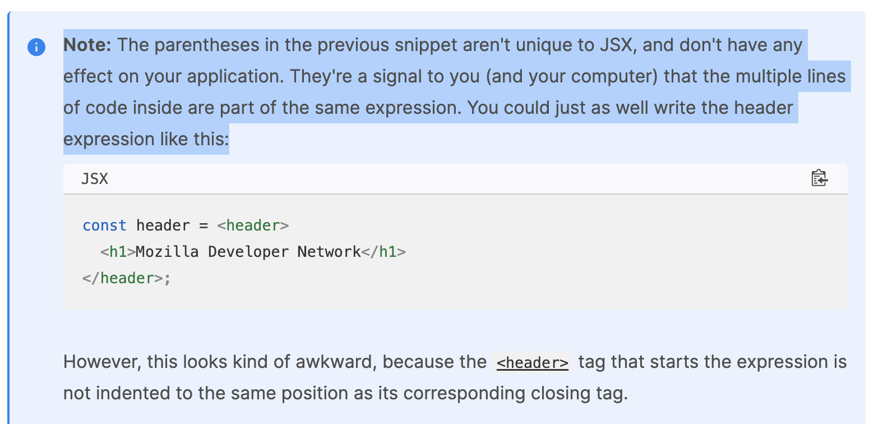
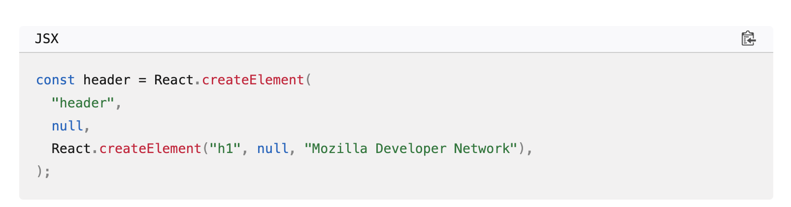

# React 
Getting started with React
https://developer.mozilla.org/en-US/docs/Learn/Tools_and_testing/Client-side_JavaScript_frameworks/React_getting_started

React uses an HTML-in-JavaScript syntax called JSX (JavaScript and XML). Familiarity with both HTML and JavaScript will help you to learn JSX, and better identify whether bugs in your application are related to JavaScript or to the more specific domain of React.
//
React uses an HTML-in-JavaScript syntax called JSX (JavaScript and XML). Familiarity with both HTML and JavaScript will help 
you to learn JSX, and better identify whether bugs in your application are related to JavaScript or to the more specific domain of React.

//
To set up a local React development environment, create a start app, and understand the basics of how it works.
To set up a local React development environment, create a start app, and understand the basics of how it works.
\
React Native  React is a library for building user interfaces. 
React is a library for building user interfaces.
React's primary goal is to minimize the bugs that occur when developers are building UIs.
// React's primary goal is to minimize the bugs that occur when developers are building UIs.
. React can handle a single button, a few pieces of an interface, or an app's entire user interface.
React can handle a single button ,a few pieces of an interface, or an app's entire user interface.

While React can be used for small pieces of an interface, it's not as easy to "drop into" an application as a library like jQuery, or even a framework like Vue — it is more approachable when you build your entire app with React.
While React can be used for small pieces of an interface, it's not as easy to "drop into " an application as a library like 
jQuery, or even a framework like Vue - It is more approachable when you build your entire app with React.

Adding a compiler like Babel to a website makes the code on it run slowly, so developers often set up such tooling with a build step. React arguably has a heavy tooling requirement, but it can be learned.\
Adding a compiler like Babel to a website makes the code on it run slowly, so developers often set up such tooling with a build step. React arguably has a heavy tooling requirement, but it can be learned.

This article is going to focus on the use case of using React to render the entire user interface of an application with the support of Vite, a modern front-end build tool.

This article is going to focus on the use case of using React to render the entire user interface of an application with the support of Vite, a modern front-end build tool.
https://vitejs.dev/

This heading constant is known as a JSX expression. React can use it to render that <h1> tag in our app.
Suppose we wanted to wrap our heading in a <header> tag, for semantic reason? The JSX approach allows us to nest our 
elements within each other, just like we do with HTML;

Note: The parentheses in the previous snippet aren't unique to JSX, and don't have any effect on your application. They're a signal to you (and your computer) that the multiple lines of code inside are part of the same expression. You could just as well write the header expression like this:
Note: The parentheses in the previous snippet aren't unique to JSX, and don't have any effect on your application. They're a signal to you (and your computer ) that the multiple lines of code inside are part of the same expression. You could just as well write the header expression like this:

Of course, your browser can't read JSX without help. When compiled (using a tool like Babel or Parcel), our header expression would look like this:
Of course, your browser can't read JSX without help. When compiled (using a tool like Babel or Parcel), our header expression would look like thins:

Popular tooling like Babel already comes with JSX support out-of-the-box, so you don't have to configure compilation yourself unless you want to.
Popular tooling like Babel already comes with JSX support out-of-the -box, so you don't have to configure compilation 
yourself unless you want to.

Because JSX is a blend of HTML and JavaScript, some developers find it intuitive. Others say that its blended nature makes it confusing. Once you're comfortable with it, however, it will allow you to build user interfaces more quickly and intuitively, and allow others to better understand your codebase at a glance.

To read more about JSX, check out the React team's Writing Markup with JSX article.

Because JSX is a blend of HTML and JavaScript , some developers find it intuitive. Others say that its blended nature makes it confusing. Once you're comfortable with it, however,it will allow you to build user interfaces more quickly and intuitively, and allow others to better understand your codebase at a glance.
 # Setting up your first React app
 
 Also bear in mind that React and ReactDOM produce apps that only work on a fairly modern set of browsers like Firefox, Microsoft Edge, Safari, or Chrome when working through these tutorials.

See the following for more information:

"About npm" on the npm blog
"Introducing npx" on the npm blog
Vite's documentation

Also bear in mind that React and ReactDOM produce apps that only work on a fairly modern set of browsers like Firefox, Microsoft Edge, Safari, or Chrome when working through thess tutorials.

http://localhost:3000/

Your terminal will have printed some messages if this command was successful. You should see text prompting you to cd to your new directory, install the app's dependencies, and run the app locally. Let's start with two of those commands. Run the following in your terminal:

Your terminal will have printed some messages if this command was successful. You should see text prompting you to cd to your  new directory, install the app's dependencies, and run the app locally. Let's start with two of those commands. Run the following in your terminal:
## Application structure
Vite gives us everything we need to develop a React application. Its initial file structure looks like this:

Vite gives us everything we need to develp a React application. Its initial file structure looks like this:

moz-todo-react
├── README.md
├── index.html
├── node_modules
├── package-lock.json
├── package.json
├── public
│   └── vite.svg
├── src
│   ├── App.css
│   ├── App.jsx
│   ├── assets
│   │   └── react.svg
│   ├── index.css
│   └── main.jsx
└── vite.config.js

index.html is the most important top-level file. Vite injects your code into this file so that your browser can run it. You won't need to edit this file during our tutorial, but you should change the text inside the <title> element in this file to reflect the title of your application. Accurate page titles are important for accessibility.

index.html is the most important top-level file. Vite injects your code into this file so that your browser can run it. You won't need to edit this file during our tutorial.

The public directory contains static files that will be served directly to your browser without being processed by Vite's build tooling. Right now, it only contains a Vite logo.
The public directory contains static files that will be served directly to your browser without being processed by Vite's build tooling. Right now, it only contains a Vite logo.

The src directory is where we'll spend most of our time, as it's where the source code for our application lives. You'll notice that some JavaScript files in this directory end in the extension .jsx. This extension is necessary for any file that contains JSX – it tells Vite to turn the JSX syntax into JavaScript that your browser can understand. The src/assets directory contains the React logo you saw in the browser.

// The src directory  is where we'll spend most of our time,as it's where the source code for our application lives. You'll notice that some JavaScript files in this directory end in the extension. jsx. This extension is necessary for any file that contains JSX - it tells Vite to turn the JSX syntax into JavaScript that your browser can understand. The src/assets directory contains the React logo you saw in the browser.

The package.json and package-lock.json files contain metadata about our project. These files are not unique to React applications: Vite populated package.json for us, and npm created package-lock.json for when we installed the app's dependencies. You don't need to understand these files at all to complete this tutorial. However, if you'd like to learn more about them, you can read about package.json and package-lock.json in the npm docs. We also talk about package.json in our Package management basics tutorial.
https://docs.npmjs.com/cli/v9/configuring-npm/package-json
https://docs.npmjs.com/cli/v9/configuring-npm/package-lock-json

The package.json and package-lock.json files contain metadata about our project. These files are not unique to React applications: Vite populated package.json for us, and npm created package-lock.json for when we installed the app's dependencies. You don't need to understand these files at all to complete this 

Note: You don't need the extra -- here because we're passing arguments directly to vite, rather than to a pre-defined npm script.

Note: You don't need the extra -- here because we're passing arguments directly to vite, rather than to a pre-defined npm script.

