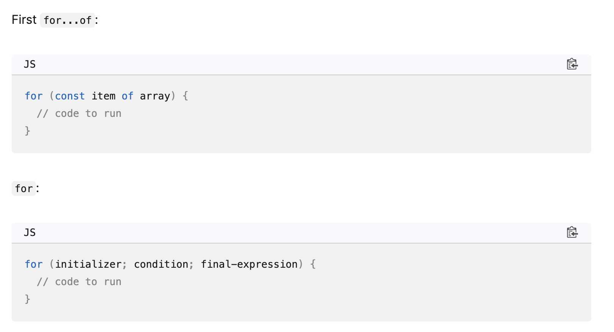

#Charles's log

## 
This is a  note
###
this is  the example 
while  , do ... while loop

initializer
while (condition) {
  // code to run

  final-expression
}

Warning: With while and do...while — as with all loops — you must make sure that the initializer is incremented or, depending on the case, decremented, so the condition eventually becomes false. If not, the loop will go on forever, and either the browser will force it to stop, or it will crash. This is called an infinite loop.

import :
With while and do...while - as with all loops - you must make sure that the initializer is incremented or , depending on the case, 
decremented, so the condition eventually becomes false. If not , the loop will go on forever, and  either the browser will force it to stop, or it will crash. This is called an infinite loop.
