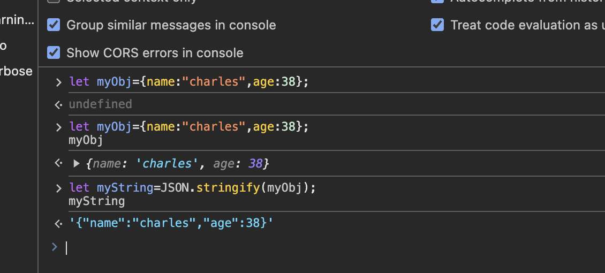

# convert string to JSON()

parse(): Accepts a JSON string as a parameter, and returns the corresponding JavaScript object.
stringify(): Accepts an object as a parameter, and returns the equivalent JSON string.\

parse():Accepts a JSON string  as a parameter, and returns the corresponding JavaScript object.
stringify(): Accepts an object as a parameter, and returns the equivalent JSON sting.

parse(): Accepts a JSON string as a parameter, and returns the corresponding JavaScript object.
stringify(): Accepts an object as a parameter, and returns the equivalent JSON string.
let myObj = { name: "Chris", age: 38 };
myObj;
let myString = JSON.stringify(myObj);
myString;

