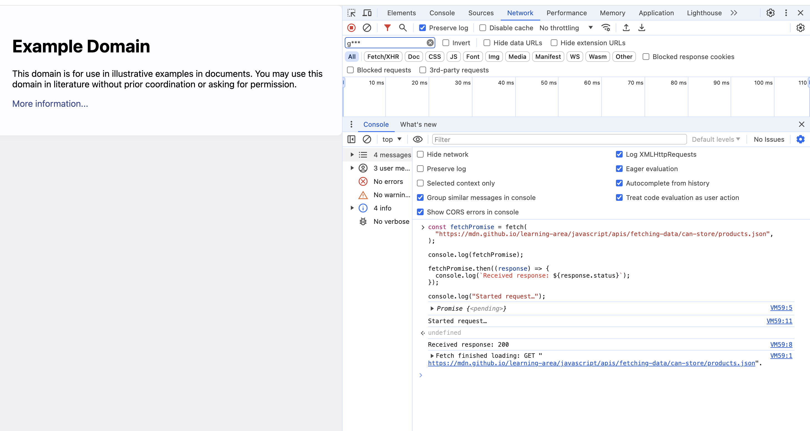
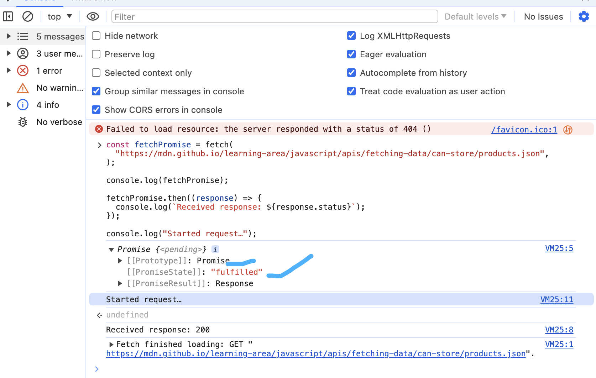
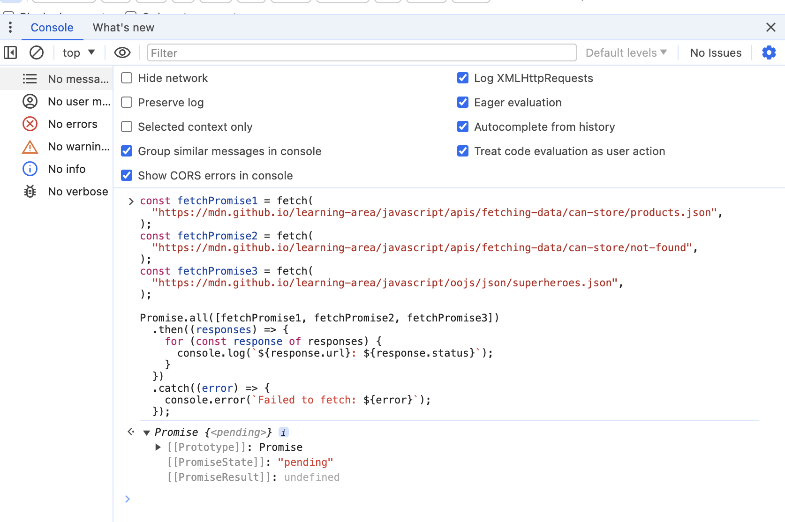

#Asynchronous JavaScript
Asynchronous JavaScript
https://developer.mozilla.org/en-US/docs/Learn/JavaScript/Asynchronous
语法糖（英語：Syntactic sugar）是由英国计算机科学家彼得·蘭丁发明的一个术语，指计算机语言中添加的某种语法，这种语法对语言的功能没有影响，但是更方便程序员使用。 语法糖让程序更加简洁，有更高的可读性。 举例来说，许多程序语言提供专门的语法来对数组中的元素进行引用和更新。
语法糖，（Syntactic sugar ） 是由英国计算机科学家彼得发明的一个术语，指计算机语言中添加的某种语法，这种语法对语言的功能没有影响，但是更方便程序员使用。语法糖让程序更加简洁，有更高的可读性，举例书

Introducing asynchronous JavaScript
https://developer.mozilla.org/en-US/docs/Learn/JavaScript/Asynchronous/Introducing

Many functions provided by browsers, especially the most interesting ones, can potentially take a long time, and therefore, are asynchronous. For example:

Making HTTP requests using fetch()
Accessing a user's camera or microphone using getUserMedia()
Asking a user to select files using showOpenFilePicker()
So even though you may not have to implement your own asynchronous functions very often, you are very likely to need to use them correctly.

In this article, we'll start by looking at the problem with long-running synchronous functions, which make asynchronous programming a necessity.

//Making HTTP requests using fetch()
Accessing a user's camera or microphone using getUserMedia()
Asking a user's camera or microphone using getUserMedia()
Asking a user to select files using showOpenFilePicker()
So even though you may not have to implement your own asynchronous functions very often, you are very likely to need to use them correctly.

In this article, we'll start by looking at the problem with long-running synchronous functions,
which make asynchronous programming a necessity.

function makeGreeting(name) {
  return `Hello, my name is ${name}!`;
}

const name = "Miriam";
const greeting = makeGreeting(name);
console.log(greeting);
// "Hello, my name is Miriam!"

Here, makeGreeting() is a synchronous function because the caller has to wait for the function to finish its work and return a value before the caller can continue.

function makeGreeting(name){
    return `Hello,my name is ${name}!`;
}
const name ='Miriam';
const greeting = makeGreeting(name);
console.log(greeting);

Here , makeGreeting() is a synchronous function because the caller has to wait for the function 
to finish its work and return a value before the caller can continue.

With a promise-based API, the asynchronous function starts the operation and returns a Promise object. You can then attach handlers to this promise object, and these handlers will be executed when the operation has succeeded or failed.

With a promise-based API, the asynchronous function starts the operation and returns a Promise object. You can then attach handlers to this promise object, and these handlers will be executed when the operation has succeeded or failed.

非常重要的域名来展示：Promise Object
https://example.org/

The article Let's talk about how to talk about promises gives a great explanation of the details of this terminology.
https://thenewtoys.dev/blog/2021/02/08/lets-talk-about-how-to-talk-about-promises/

## async and await

The async keyword gives you a simpler way to work with asynchronous promise-based code. Adding async at the start of a function makes it an async function:

The async keyword gives you a simpler way to work with asynchronous promise-based code. Adding async at the start of a function makes it an async function:

asynchronous /asynchronous/ asynchronous/ asynchronous

async function myFunction() {
  // This is an async function
}

async function myFunction(){
    // This is an async function
}

//Inside an async function, you can use the await keyword before a call to a function that returns a promise. This makes the code wait at that point until the promise is settled, at which point the fulfilled value of the promise is treated as a return value, or the rejected value is thrown.
Inside an asyn function, you can use the await keyword before a call to a function that returns a promise. This makes the code wait at that point until the promise is settled, at which point the fulfilled value of the promise is treated as a return value, or the rejected value is thrown.

## How to use promises
https://developer.mozilla.org/en-US/docs/Learn/JavaScript/Asynchronous/Promises
Promises are the foundation of asynchronous programming in modern JavaScript. A promise is an object returned by an asynchronous function, which represents the current state of the operation. At the time the promise is returned to the caller, the operation often isn't finished, but the promise object provides methods to handle the eventual success or failure of the operation.

Promises are the foundation fo asynchronous programming in modern JavaScript.A promise is an object returned by an asynchronous function,which represents the current state of the operation. At the time the promise is returned to the caller ,the operation often isn't finished, but the promise object provides methods to handle the eventual success or failure of the operation.

Generally, when you implement a promise-based API, you'll be wrapping an asynchronous operation, which might use events, or plain callbacks, or a message-passing model. You'll arrange for a Promise object to handle the success or failure of that operation properly.

Generally, when you implement a promise-based API, you'll be wrapping an asynchronous operation, wh
The key component here is the Promise() constructor. The Promise() constructor takes a single function as an argument. We'll call this function the executor. When you create a new promise you supply the implementation of the executor.

This executor function itself takes two arguments, which are both also functions, and which are conventionally called resolve and reject. In your executor implementation, you call the underlying asynchronous function. If the asynchronous function succeeds, you call resolve, and if it fails, you call reject. If the executor function throws an error, reject is called automatically. You can pass a single parameter of any type into resolve and reject.

This executor function itself takes two arguments, which are both also functions, and which are conventionally called resolve and reject. In your executor implementation, you call the underlying asynchronous function. If the asynchronous function succeeds ,you call resolve, and if it fails, you call reject. If the executor function throws an error, reject is called automatically. You can pass a single parameter of any type into resolve and reject.
This function creates and returns a new Promise. Inside the executor for the promise, we:

check that delay is not negative, and throw an error if it is.
call setTimeout(), passing a callback and delay. The callback will be called when the timer expires, and in the callback we call resolve, passing in our "Wake up!" message.

// Check that delay is not negative, and throw an error if it is.
call setTimeout(),passing a callback and delay. The callback will be called when the timer 
expire, and in the callback we call resolve, passing in our "Wake up !" message.

## Introducing workers
https://developer.mozilla.org/en-US/docs/Learn/JavaScript/Asynchronous/Introducing_workers

One concern from all this is that if multiple threads can have access to the same shared data, it's possible for them to change it independently and unexpectedly (with respect to each other). This can cause bugs that are hard to find.

One concern from all this is that if multiple threads can have access to the same shared data, it's possible for them to change  it independently and unexpectedly (with respect to each other ). This can cause bugs that are hard to find.
