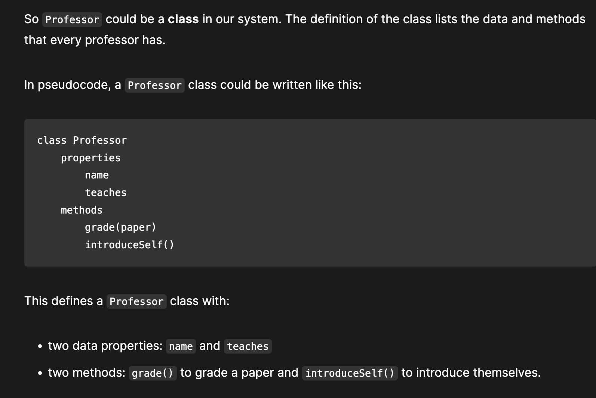
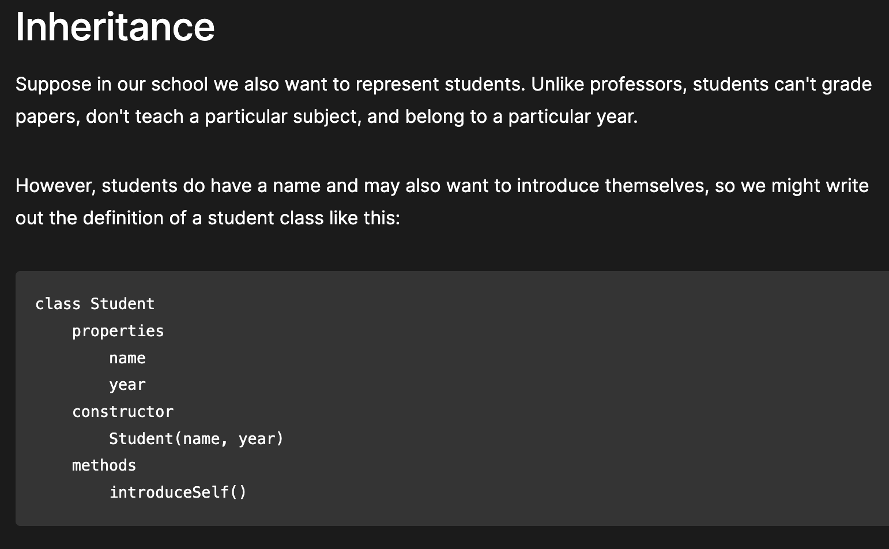
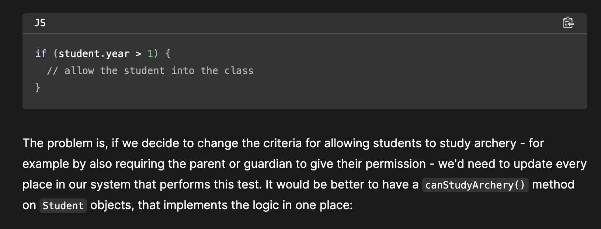

# prototype is practice

## Setting  a Prototype
personPrototype

Using Object.create

const personPrototype ={
    greet (){
        console.log("Hello");
    },
}

const charles = Object.create(personPrototype);
charles.greet();
 Here we create an object personPrototype, which has a greet() method. We then use Object.create() to create a new object with personPrototype as its prototype. Now we can call greet() on the new object, and the prototype provides its implementation.

 Here we create an object personPrototype, which has a greet() method. We then use Object.create()
 to create a new object with personPrototype as its prototype.Now we can call greet() on the new object, and the prototype provides its implementation.

const personPrototype={
    greet(){
        console.log(`Hello,where are you from? my name is ${this.name}!`);
    },

};
function Person(name){
    this.name = name;
}

Object.assign(Person.prototype,personPrototype);
//Person.prototype.greet = personPrototype.greet;
// Person.prototype.greet = personPrototype.greet;

It's common to see this pattern, in which methods are defined on the prototype, but data properties are defined in the constructor. That's because methods are usually the same for every object we create, while we often want each object to have its own value for its data properties (just as here where every person has a different name).

It's common to see this pattern, in which methods are defined on the prototype, but data properties are defined in the constructor. That's because methods are usually the same for every object we create, while we often want each object ot have its own value for its data properties (just as here where every person has a different name).

 object-oriented programming languages 
 object-oriented programming languages
 object-oriented programming languages
 For example, if we're modeling a school, we might have professors and students: they are both people, so have some features in common (for example, they both have names), but each might add extra features (for example, professors have a subject that they teach), or might implement the same feature in different ways. In an OOP system we might say that professors and students both inherit from people.

For example, if we're modeling a school, we might have professors and students: they are both people, so have some features in common (for example, they both have names),but each might add
extra features (for example, professors have a subject that they teach ), or might implement 
the same features in different ways. In an OOP system we might say that professors and students both inherit from people.

Object-oriented programming
https://developer.mozilla.org/en-US/docs/Learn/JavaScript/Objects/Object-oriented_programming

Object-oriented programming (OOP) is a programming paradigm fundamental to many programming languages, including Java and C++. In this article, we'll provide an overview of the basic concepts of OOP. We'll describe three main concepts: classes and instances, inheritance, and encapsulation. For now, we'll describe these concepts without reference to JavaScript in particular, so all the examples are given in pseudocode.

Object-oriented programming (OOP) is a programming paradigm fundamental to many programming languages, including Java and C++. In this article, we'll provide an overview of the basic 
concepts of OPP. We'll describe three main concepts: classes and instances, inheritance, and encapsulation. For now, we'll describe these concepts withour reference to JavaScript, in particular, so all the examples are given in pseudocode.

Object-oriented programming is about modeling a system as a collection of objects, where each object represents some particular aspect of the system. Objects contain both functions (or methods) and data. An object provides a public interface to other code that wants to use it but maintains its own private, internal state; other parts of the system don't have to care about what is going on inside the object.

Object-oriented programming is about modeling a system as a collection of objects, where each object represents some particular aspect of the system. Objects contain both functions (or methods) and data. An object provides a public interface to other code that wants to use it but 
maintains its own private, internal state; other parts of the system don't have to care about what is going on inside the object.

class Professor 
    properties
        name
        teaches
    constructor
        Professor(name,teaches)
    methods
        grade(paper)

walsh = new Professor("Walsh", "Psychology");
lillian = new Professor("Lillian", "Poetry");

walsh.teaches; // 'Psychology'
walsh.introduceSelf(); // 'My name is Professor Walsh and I will be your Psychology professor.'

lillian.teaches; // 'Poetry'
lillian.introduceSelf(); // 'My name is Professor Lillian and I will be your Poetry professor.'

Inheritance

class Student
    properties
        name
        year
    constructor
        Student(name,year)
    methods
        introduceSelf()

class Person
    properties
        name
    constructor
        Person(name)
    methods
        introduceSelf()

class Professor: extends Person
    properties
        teaches
    constructor
        Professor(name,teaches)
    methods
        introduceSelf()

class Student : extends Person
    properties
        year
    constructor
        Student(name,year)
    methods
        introduceSelf()

//In this case, we would say that Person is the superclass or parent class of both Professor and Student. Conversely, Professor and Student are subclasses or child classes of Person.

You might notice that introduceSelf() is defined in all three classes. The reason for this is that while all people want to introduce themselves, the way they do so is different:

In this case, we would say that Person is the superclass or parent class of both Professor and Student. Conversely,
Professor and Student are subclasses or child classes of Person.

You might notice that introduceSelf() is defined in all three classed. The reason for this is that while all people want to introduce themselves, the way they do so is different:

This feature - when a method has the same name but a different implementation in different classes - is called polymorphism. When a method in a subclass replaces the superclass's implementation, we say that the subclass overrides the version in the superclass.
This feature - when a method has the same name but a different implementation in different classes - is called polymorphism
When a method in a subclass replaces the superclass's implementation, we say that the subclass overrides the bersion tin the superclass.
##封装
## Encapsulation

Objects provide an interface to other code that wants to use them but maintain their own internal state. The object's internal state is kept private, meaning that it can only be accessed by the object's own methods, not from other objects. Keeping an object's internal state private, and generally making a clear division between its public interface and its private internal state, is called encapsulation.

Objects provide an interface to other code that wants to use them but maintain their own internal state. The object's
internal state is kept private, meaning that it can only be accessed by the object's own  methods, not from other objets.
Keeping an object's internal state private, and generally making a clear division between its public interface and its private internal state, is called encapsulation.

This is a useful feature because it enables the programmer to change the internal implementation of an object without having to find and update all the code that uses it: it creates a kind of firewall between this object and the rest of the system.

This is a useful features because it enables the programmer to change the internal implementation of an object without having to find and update all the code that uses it: it creates a kind of firewall between this object and the rest of the system.

The problem is, if we decide to change the criteria for allowing students to study archery - for example by also requiring the parent or guardian to give their permission - we'd need to update every place in our system that performs this test. It would be better to have a canStudyArchery() method on Student objects, that implements the logic in one place:

The problem is, if we decide to change the criteria for allowing students to study archery -for example by also requiring 
the parent or guardian to give their permission - we'd need to update every place in our system that performs this text. It would be better to have a canStudyArchery() method on Student objects, that implements the logic in one place:
class Student : extends Person
    properties
       year
    constructor
       Student(name, year)
    methods
       introduceSelf()
       canStudyArchery() { return this.year > 1 }

class Student : extends Person
    properties
        year
    constructor
        Student(name,year)
    methods
        introduceSelf()
        canStudyArchery(){ return this.year > 1}

if (student.canStudyArchery()) {
  // allow the student into the class
}

if (student.canStudyArchery()){
    // allow the student into the class
}

That way, if we want to change the rules about studying archery, we only have to update the Student class, and all the code using it will still work.

That way, if we want to change the rules about studying  archery, we only have to update the Student class, and all the code 
using it will still work.

class Student: extends Person
    properties
        private year

    constructor
        Student(name,year)
    methods
        introduceSelf()
        canStudyArchery(){return this.year >1}
student = new Student('charles',1)
student.year // error: 'year' is a private property of student
student = new Student('Weber', 1)
student.year // error: 'year' is a private property of Student
In languages that don't enforce access like this, programmers use naming conventions, such as starting the name with an underscore, to indicate that the property should be considered private.

In languages that don't enforce access like this, programmers use naming conventions, such as starting the name with an 
underscore, to indicate that the property should be considered private.
